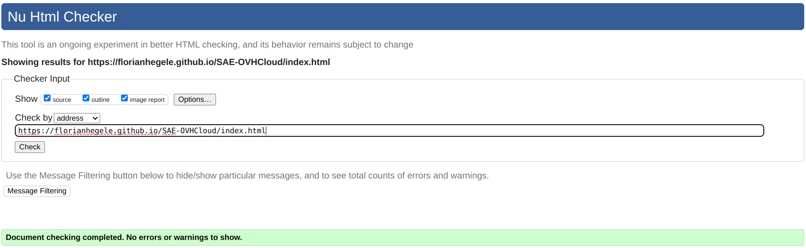
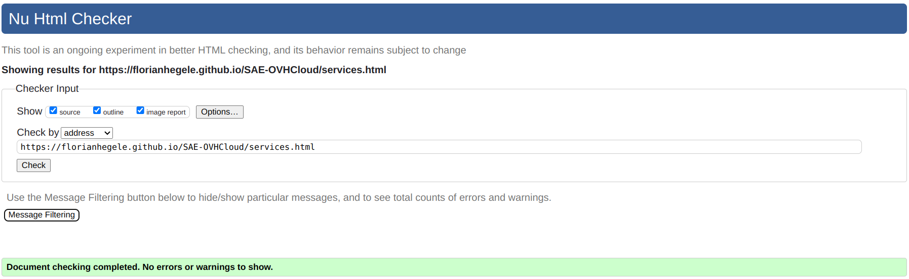
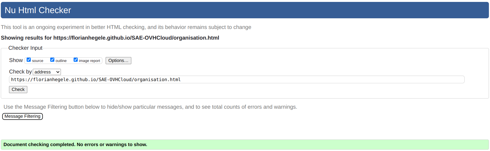
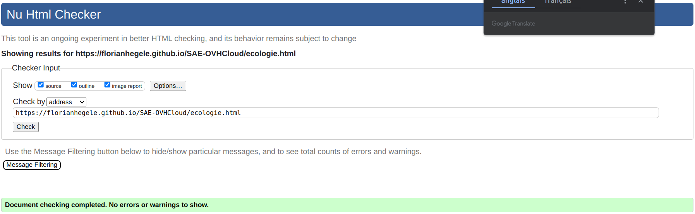

# s1-OVHcloud

## Sujet  

SAE-OVHcloud\
[Lien du site du projet](https://florianhegele.github.io/SAE-OVHcloud/)

## Membres du groupe n°6 :  
 - [Blessing Théo (référent)](mailto:theo.blessing@edu.univ-fcomte.fr?subject=SAE_1_05_06)
 - [Caruhel Rémy](mailto:remy.caruhel@edu.univ-fcomte.fr?subject=SAE_1_05_06)  
 - [Catry Benoit](mailto:benoit.catry@edu.univ-fcomte.fr?subject=SAE_1_05_06)  
 - [Hegele Florian](mailto:florian.hegele@edu.univ-fcomte.fr?subject=SAE_1_05_06)  

## Présentation 
Ce dépôt correspond à un site web créé en HTML/CSS/JS dans le cadre de la SAÉ 05-06 à l'IUT de Belfort-Montbéliard. Ce site présente des informations concernant l'entreprise OVHcloud et sert de vitrine pour présenter l'entreprise, ses activité, son organisation et son historique. Vous trouverez dans ce dépôt et sur le site un rapport économique analysant l'aspect économique d'OVHcloud. 

## Choix de conception  
Pour la conception du site, nous nous sommes grandement inspirés du site officiel de OVHcloud (trouvable [ici](https://www.ovhcloud.com/fr/)), et nous avons pris comme référence la template suivante disponible [ici](https://startbootstrap.com/previews/clean-blog-jekyll).    

## Développement Site Web et Validation des pages

### Page d'Accueil
**Auteur : Blessing Théo**  

Vérification W3C : [Détail ICI](https://validator.w3.org/nu/?showsource=yes&showoutline=yes&showimagereport=yes&doc=https%3A%2F%2Fflorianhegele.github.io%2FSAE-OVHcloud%2Findex.html)

### Page des Services
**Auteur : Hegele Florian**  

Vérification W3C : [Détail ICI](https://validator.w3.org/nu/?showsource=yes&showoutline=yes&showimagereport=yes&doc=https%3A%2F%2Fflorianhegele.github.io%2FSAE-OVHcloud%2Fservices.html)

### Page de l'Organisation
**Auteur : Rémy Caruhel**  

Vérification W3C : [Détail ICI](https://validator.w3.org/nu/?showsource=yes&showoutline=yes&showimagereport=yes&doc=https%3A%2F%2Fflorianhegele.github.io%2FSAE-OVHcloud%2Forganisation.html)

### Page des Finances
**Auteur : Benoit Catry**  

Vérification W3C : [Détail ICI](https://validator.w3.org/nu/?showsource=yes&showoutline=yes&showimagereport=yes&doc=https%3A%2F%2Fflorianhegele.github.io%2FSAE-OVHcloud%2Ffinances.html)

### Page de l'Ecologie
**Auteur : Benoit Catry**  

Vérification W3C : [Détail ICI](https://validator.w3.org/nu/?showsource=yes&showoutline=yes&showimagereport=yes&doc=https%3A%2F%2Fflorianhegele.github.io%2FSAE-OVHcloud%2Fecologie.html)

## Répartition du travail

### Planification - Diagramme de GANTT

- Blessing Théo
- Benoit Catry
- Hegele Florian

### Recherches d'informations

- Blessing Théo
- Benoit Catry
- Caruhel Rémy
- Hegele Florian

### Rapport économique

- Blessing Théo
- Benoit Catry
- Hegele Florian

### Développement site

- Hegele Florian
  - Page des Services
  - "Template" du Header et de la Navbar
  - "Template" du Footer
- Catry Benoit
  - Page des Finances
  - Page de l'Ecologie
- Blessing Théo
  - Page d'Accueil
- Caruhel Rémy
  - Page de l'Organisation
